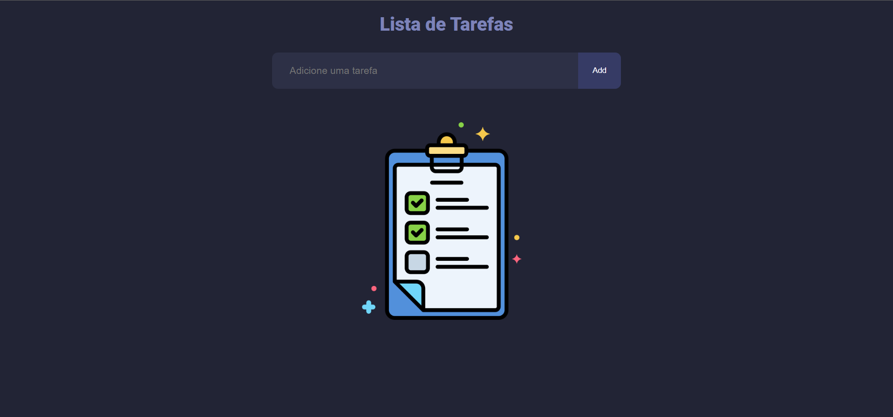
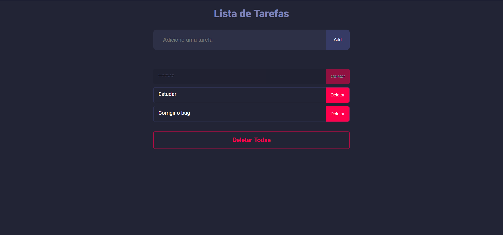

# Lista de Tarefas

Projeto feito em React para gerenciar tarefas de forma simples. Contém as funções de marcar as tarefas já concluídas, deletar uma tarefa individual ou deletar todas. O projeto também é dark mode por padrão e totalmente responsivo.

## Deploy

Para conferir o deploy desse projeto [acesse aqui o link.](https://keuwey.github.io/lista-de-tarefas/)

## Screenshots

